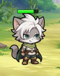
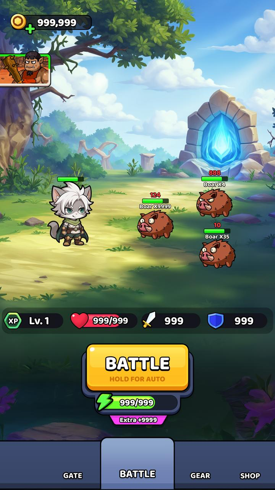

# Tech Art UI Button Test 7/2025

This is a
test for the Tech Art UI Button for Sugar Games Ltd.

## Test Time & Notes

1. The test should take between 4 to 8 hours, depending on the level and speed of the candidate.
2. Feel free to ask any questions any guidance the you need. [shahar@sugargames.co](https://github.com/sgr-games/ta-ui-test-2025-7)
3. You can use any resources you want, same as real world.
   1. ChatGPT
   2. Tools
   3. Internet
   4. Cursor
   5. Assets

## Prerequisites

1. Unity 6000.0.51f1
2. Adobe Photoshop
3. Open Project [My project](My%20project) and edit the scene[SampleScene.unity](My%20project/Assets/Scenes/SampleScene.unity)

## Task Description

Implement the button from the PSD file into Unity and add effects.

## Instructions

1. Open PSD file [LobbuButtonTest.psd](LobbuButtonTest.psd)
2. Cut sprites from the PSD 
3. Use TextureSheet to import the sprites into Unity, recommend to use - https://www.codeandweb.com/texturepacker
4. Use the sprites to create the button in Unity Scene
5. Make sure there are 3 states: Normal, Pressed, AutoSpin
6. Add Effects to the button, should feel good and juicy

## Submission

1. Fork this repository
2. Add all your work to the project
3. Push to your fork
4. Send us a link to the fork
5. Remember to give access to [shahar@sugargames.co](https://github.com/sgr-games/ta-ui-test-2025-7)

### 5. **Add Video of your work to the repository**

# Mocks 

Full button area with energy is part of the test

How the screen look like, please only do the button, you can use it as reference 

