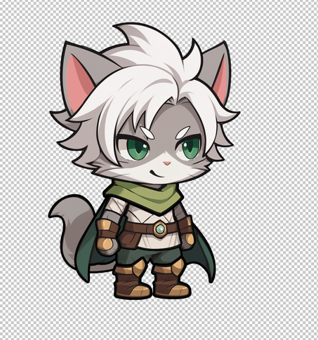

# Tech Art Character Test 7/2025

This is a test for the Tech Art Character for Sugar Games Ltd.

## Test Time & Notes

1. The test should take between 4 to 8 hours, depending on the level and speed of the candidate.
2. Feel free to ask any questions any guidance the you need. [shahar@sugargames.co](https://github.com/sgr-games/ta-ui-test-2025-7)
3. You can use any resources you want, same as real world.
   1. ChatGPT
   2. Tools
   3. Internet
   4. Cursor
   5. Assets

## Prerequisites

1. Unity 6000.0.51f1
2. Adobe Photoshop
3. Open Project [My project](My%20project) and edit the scene[SampleScene.unity](My%20project/Assets/Scenes/SampleScene.unity)

## Task Description

Implement the character design in Unity, Rig it, and animate it.

## Instructions

1. Open PSD file [hero_cat.psd](hero_cat.psd)
2. Cut sprites from the PSD 
3. Import the sprites to the project
4. Using Unity2D Bones rig the character
5. Bring the character into the scene
6. Animate the character
   1. Idle
   2. Attack

## Submission

1. Fork this repository
2. Add all your work to the project
3. Push to your fork
4. Send us a link to the fork
5. Remember to give access to [shahar@sugargames.co](https://github.com/sgr-games/ta-ui-test-2025-7)

### 5. **Add Video of your work to the repository**

# Mocks 

Character - 

How the screen look like, please only do the button, you can use it as reference 

